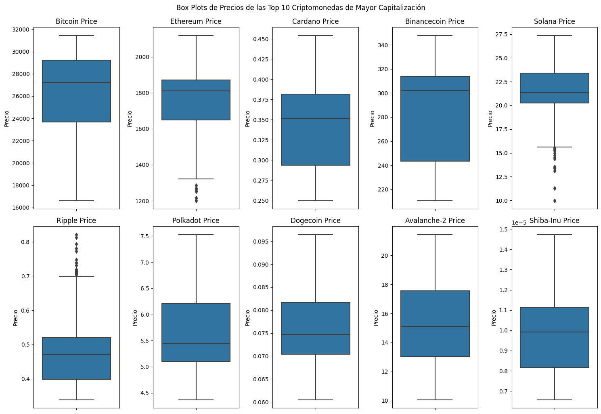
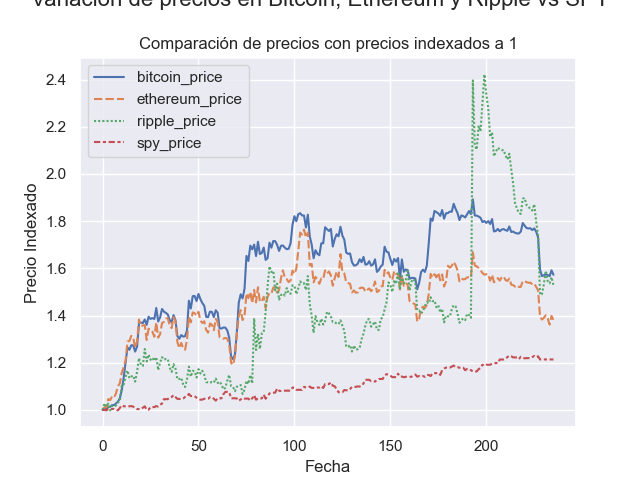
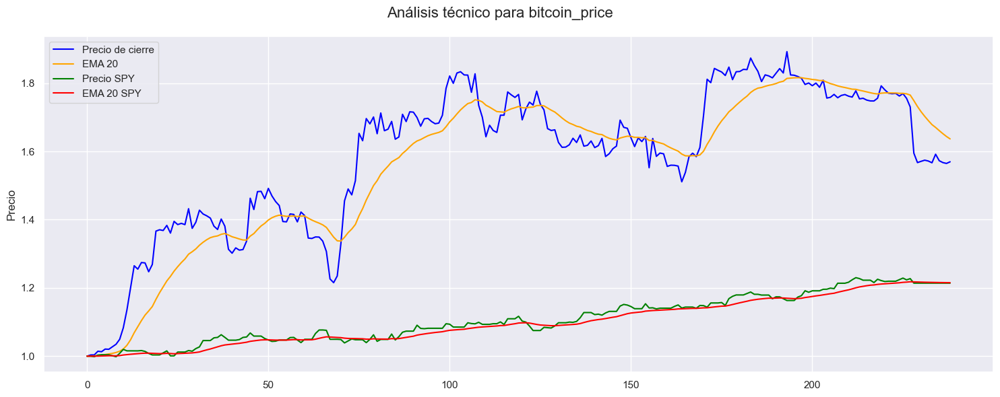
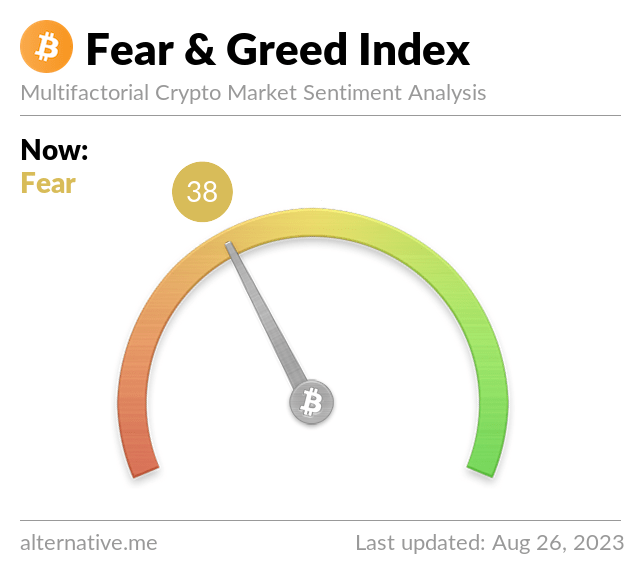

#**Proyecto Indivudual PT02 "Cryptocurrency Market Data Analytics"**

##**Objetivo**
El objetivo del proyecto es hacer un análisis del mercado de las criptomonedas, para determinar si conviene o no invertir en ellas, y en cuáles, en el año 2023, para obtener rendimientos mayores a inversiones más conservadoras, como pueden ser los bonos del Tesoro de Estados Unidos. La recomendación final está dirigia a un público que cuenta con una cartera de riesgo intermedia (ni muy conservadora, ni muy arriesgada), en donde deja un 25% de margen de su portafolio para invertir en alternativas de inversión consideradas de riesgo.

##**Resultados del análisis**
Adelantamos la recomendación del análsis que se expondrá debajo: elegimos al Bitcoin como primer alternativa de inversión para cubrir el 18% de la cartera de criptomonedas, y le damos una chance a Ripple(7%), que se comportó más volatil pero va en ascenso en las últimas semanas. El resto, lo dejamos en inversiones seguras para ahorro de largo plazo, 80%, por ejemplo, en un 50% de ese 80% en SPY, y un 50% en bonos del Tesoro de Estados Unidos, considerados los más cosnervadores de todos los activos de inversión.

##**Desarrollo**

###Fuentes
A lo efectos del análisis, se tomaron como fuentes de datos primaria los datasets de CoinGecko, uno de los sitios más reconocidos que recaba las más amplia información sobre las criptomonedas, y que provee una api para que los desarrolladores puedan extraer dichos datos. CoinGecko provee información de mercado de más de 4000 criptomonedas. También se acudió a sitios especializados de inversión investing.com para poder tomar series de datos históricas de los bonos del Tesoro de Estados Unidos, y de la performance de las 500 empresas más importantes de Estados Unidos, medidas por un instrumento derivado que sigue al índice S&P 500, más conocido como el SPY.  Alternativamente se buscaron los valores históricos del dólar blue en la Argentina, de sitios no oficiales pero que monitorean diaramiente las cotizaciones implícitas en el mercado para tomar el dólar, y para extraer dichos datos se utilizó la técnica de webscrapping.

##**#EDA**
Como primer paso para comenzar con el análisis exploratorio de datos, se extrajo la serie de tiempo de las 10 monedas de mayor capitalización de mercado, debido a que son monedas que manejan volumen importante, y por lo tanto son relativamente líquidas, es decir, unn inversores puede ingressar y salir del mercado cuando lo considere, ya que seguramente podrá enconrar fácilmente un comprador u vendedor, depenndiendo de la operación que quiera realizar.
Es de destacar también que  las 10 criptomonedas de mayor precio también coinciden con las de mayor volumen, aunque el orden en el ranking o sea el mismo, todas se mantienen entre las TOP ten.
De esta forma, se determinó que Bitcoin, Ethereum, Cardamo, Ripple, Binancecoin, Solana, Polkadot, Dogecoin, Avalanche-2 y Shiba-inu integran el universo top 10 .
Nos planteamos como objetivo inicial analizar el desempeño de los precios de las 10 monedas durante 2023, aunque más adelante, por los resultdos obtenidos durante el EDA, decidimos quedarnos sólo con 3 criptomonedas: Bitcoin, Ethereum y Ripple.
Procedimos a hacer un un dataframe con la serie de tiempo de las 10 monedas, en el que eliminamos algunas columnas del dataset original, para quedarnos sólo con capitalizacion de mercado, volumen, precio del día, entre las más signficativas (por ejemplo,se eliminaron los precios de apertura y cierre para simplificar el análisis). 
Hubo un procedimiento rápido de limpieza (nulos, faltantes, duplicados), debido que las bases de datos de CoinGecko estaban bastante limpias.
Extrajimos de la Api datos del mercado y e históricos de las criptomonedas mencionadas; para ello armamos una función que extrajera los datos históricos de las 10 monedas, y hubo que modificar la columna de fecha para poder trabajar con los datos. Luego, se fusionaron los dataframes de las 10 monedas en 1 dataframe, a través del campo fecham para comenzar con el análisis más en profundidad.
Al comparar la evolución de las monedas en un gráfico, observamos que había escalas muy diferentes entre las criptomonedas, sobre todo el Bitcoin se diferencia mucho del resto. En consecuencia, procedimos a normalizar variables pero antes calculamos los outliers y la distribucion de las frecuencias de cada uno, para saber por dónde se ubicó el precio con mayor frecuencia durante 2023.
Se observó que Ethereum, Solana, y Ripple tenían otuliers, y se estudiaron los precios a partir de los umbrales. En el caso de Eheterum (umbral =1300 U$S) y Solana (umbral=15 U$D), se observó que os outliers tienen que ver con los mínimos del principios de 2023, cuando los precios de las criptomonedas estuvieron en lo más bajo, en lo que va de 2023. 
En cambio en Ripple (umbral 0.69 U$D), los outliers se encuentran al final de la serie, donde se observó que hubo una aceleración de precio desde fines de julio  y quecontinuó en agosto. Dejamos en la serie los outliers en el primer caso (Ethereum y Solana) para conservar la integridad temporal, y en el segundo(Ripple), porque da cuenta de una aceleración de las últimas semanas y puede ser un determinante a la hora de decidir inveritr en dicha moneda. 
En cuanto a Ripple, las noticas dieron cuenta de que tuvo una victoria parcial ante la comisión de regulación de EEUU (SEC) y animó a inversores a seguir invirtiendo. Los informes públicos disponibles señalan que:
-Los inversores institucionales han invertido en Ripple (XRP) durante 16 semanas consecutivas según un informe de CoinShares.
-Los activos bajo gestión de productos de inversión en XRP han aumentado un 127% desde principios de año.
-Se han invertido mas de $11,25 millones en XRP desde comienzos de 2023.

Vale acotar que las criptomonedas tuvieron un pésimo año durante 2022, ya que venían de un pico pospandemia en 2021. El cambio de humor en 2022 se debió al cambio de política monetaria de la Reserva Federal de los Estados Unidos, que se endureció a través de la aplicación de sucesivas tasas de interés, para cumplir con el objetivo de bajar la inflación en los Estados Unidos. Luego, en 2023, la FED continuó con la suba de las políticas de tasas, pero de manera más moderada, y el mercado ya comenzó la vuelta a la inversión en criptomonedas, previendo que pronto la FED comenzará a estancar o flexibilizar su política de tasas de interés, lo que inyectará de nuevo mayor liquiidez al mercado, y habrá en general más dinero disponible para inversiones y para arriesgar también en criptomonedas, considerados activos de mayor riesgo.
Asimismo, intentamos ver correlaciones entre monedas a través de distintas técnicas. Tanto en el scatterplot como en la matriz de correlación se observó que Bitcoin y Ethereum tienen una alta correlacón positiva. Cuando Bitcoin sube, también sube Ethereum, y lo mismo cuando el sentimiento es negativo hacia estas monedas: cuando baja una, también baja la otra. 
Por otro lado, se ubican Cardano, Binance, y Dogecoin, Avalanche-2 y Polkadot, todas  con una fuerte correlacion positiva. Esto es, cuando una de ellas se incrementa, también se incrementa la otra, aunque la correlación no implique que el ascenso de una moneda sea la causa de la otra. 

## **KPI´s**

###**Variación en el precio del activo**

Luego procecidmos a aanlizar el desempeño de las monedas elegidas, según la variación en el precio. Esta un una métrica imprescindible, a la hora de determinar qué moneda elegir.
Entre las criptomoedas de mayor capitalización, durante el 2023 las monedas de mejor desempeño en el precio resultaron el Bitcoin (59,49%),  Ripple(48,8%) y Ethereum(39,58%), entre las tres primeras del ranking de variación de precios. 
Con estso datos, decidimos quedaronos con estas tres primeras para acotar el análisis y compararlas con el desempeño de las acciones de Estados Unidos. Para hacer dicho anaálisis, elegimos el SPY, que es el ticker y el nombre coloquial del derivado (ETF) que emula el comportamiento del S&P 500. El índice que mira el comportamiento de las 500 mayores empresas de la Economía de EEUU y es un buen indicador para medir la salud de las economía y las empresas en general, que a su vez están muy afectadas por la inflación e inflación esperada, que se observa en las políticas que toma la Reserva Federal de los Estados Unidos, a través de la política monetaria y en particular de los movicmientos en las tasa de interés de referencia. 
Esto afecta particularmente el mercado de las criptomonedas, ya que si se espera que la economía de EEUU empeore, en el sentido de que suba la inflación y la FED se vea obligada a subir las tasas, habrá más retracción en la inversión y  fuga de capitales hacia activos considerados más seguros, que tendrán un rendimiento mayor, y son considerados y menos volátiles. Por el contrario, si hay mejora en la marcha de las empresas y de la salud de la economía en general, con una baja inflación, la FED hará la política contraria, expandirá más dinero en la economía para invertir, y las criptomonedas tendrán mayor margen de aceptación enre los inversores.    
En este sentido, procedimos a extraer los datos de precios de la base de datos de SPY y la incorporamos al dataframe de precios de las criptomonedas. Aquí si hubo que hacer algunas trasnformaciones para poder utilizar los datos. Por un lado, hubo que modificar la columna fecha, por otro lado, hubo que completar faltantes, porque SPY es un indicador que no tiene operaciones el fin de semana, y que opera en la Bolsa de EEUU. En cambio, las criptomonedas operan 24 horas, cualquier día del año, en OTC, over the counter, ya que no están reguladas oficialmente. Sólo existen algunos derivados que sí cotizan en la Bolsa de EEUU, y que emulan el compotamiento de las criptomonedas top.
Una vez realizadas las trasnformaciones pertinentes, se dividieron los precios por el primer valor para indexarlos a uno, y poder ver bien cual es la moneda que más varió y compararla con el comportamiento del SPY.
Corroboramos que Bicoin es la moneda que más creció en lo que va de 2023, y comprobamos que las tres criptomonedas repuntaron en linea con el SPY, que va anticipando que la inflación en EEUU se está pudiendo controlar y que en breve la FED virará el timón de su política. La suba del SPY es constante y menos pronunciada que las de las criptomonedas, que son más volátiles. Estos se debe a que el SPY es un índice que va marcando de una manera más conservadora las salud de las 500 empresas de la economía, si está subiendo, las compañias de EEUU en general están mejor. Aunque de manera más volátil, las criptomonedas TOP3 tuvieron una importante suba, mucho mayor al SPY, y eso tambbién tiene que ver con que son inversiones más, volatiles menos conservadoras y po sobre todo porque en 2022 hubo un desplome, y tienen aún mucho precio por recuperar de sus valores máximos históricos.
Pese a la expectacular suba de Bitcoin de casi 60%  durante lo que va de 2023, al cierre de este informe aún está a 26.000 dólares, esto es menos de la mitad de su pico histórico de fines de 2021, cuando tocó los 68,992 dólares.

###**Indicador EMA20** 

Otro indicador clave que vamos a tomar en considereación para invertir o no en criptomonedas, y en cúal , es el EMA20, que calcula las medias móviles exponenciales, para determinar si una moneda está en su fase de suba (y puede resultar interesante para su compra) o eventual baja (y determinar si conviene vender dicho activo).
Para efectos de simplicidad y prácticos, quitamos los campos de precio de inicio y cierre de la base de datos, con lo cual no haremos gráficos de velas, sino de promedios exponenciales.
Hacemos promedios exponenciales (y no las medias simples) porque estos indicadores toman con mayor ponderación los ultimos valores de las serie, para tratar vaticinar una futura suba o baja en el precios
El EMA20 (Exponential Moving Average 20) calcula la media móvil exponencial de los últimos 20 días. Es decir, toma en cuenta los precios de los últimos 20 días, otorgando mayor peso a los datos más recientes y reduciendo gradualmente el peso de los datos más antiguos. Esto la hace más sensible a los cambios recientes en los precios y puede ayudar a capturar tendencias emergentes o cambios en la dirección del mercado más rápidamente que una media móvil simple (SMA).
Si el EMA 20 está por encima del precio de cierre, puede indicar una tendencia alcista o positiva. Esto sugiere que la tendencia general de los precios es ascendente y el activo podría estar ganando fuerza. Puede interpretarse como una señal de compra.
EMA 20 Por Debajo del Precio de Cierre: Si el EMA 20 está por debajo del precio de cierre, puede indicar una tendencia bajista o negativa. Esto sugiere que la tendencia general de los precios es descendente y el activo podría estar perdiendo fuerza. Puede interpretarse como una señal de venta.
Cruce de EMA y Precio de Cierre: Uno de los patrones técnicos comunes es el cruce entre el EMA y el precio de cierre. Un "cruce alcista" ocurre cuando el EMA cruza por encima del precio de cierre, lo que puede indicar un cambio potencial hacia una tendencia alcista.
Por lo que se desprende de las observaciones del EMA, el Bitcoin aún tiene margen para seguir subiendo.

###**The Fear and Greed Index o Indicador del Miedo y Codicia**

Otro de los indiadores de desempeño que vamos a tomar en cuenta es el "The Fear and Greed Index in Investing", indicador popular de sentimiento en Bitoin, pero se tiene en cuenta para otraa criptomonedas también debido a que Bitcoin domina el espacio de las criptomonedas (tiene una dominancia de mercado de ) y de algua forma ditamina el comportamiento de otras criptomonedas. Hoy este indicador se encuentra en la etapa de "fear, con 39 puntos", esto es, viene de haber estado más bajo, con mayor miedo a invertir mayor a hoy, cuando ese miedo es menor, y por lo que se ve hay un magen para seguir invirtiendo cuando hay miedo, y esperar, hasta que se vaya el miedo del inversor y todo el mundo este comprando -mayor codicia-, y sea la hora de, precisamente, salir en lo más alto.
Por otro lado en nuestro análisis arriba observamos que Bitocoin Ethereum estaban altamente correlacionadas en los precios.
Otro dato a destacar de este indicador del es que sería más relevante para el corto plazo, y nosotros precisamente queremos armar una cartera de nversión en el corto plazo para decidir si destinar un 25% en criptomonedas y aprovechar la eventual suba de lo que queda del 2023, para un inversor de riesgo intermedio.

##**Conclusión**
Por todas estas razones, por ser el activo de mayor capitalización, de mayor suba de precio en 2023, de que queda un potencial margen de suba,  según se ve en el EMA20 y en el Indice del Miedo y Codicia, elegimos al Bitcoin como primer alternativa de inversión para cubrir el 18% de la cartera de criptomonedas, y le damos una chance a Ripple(7%), que se comprotó más volatil pero va en ascenso en las últimas semanas.
El resto, lo dejamos en inversiones más seguras para ahorro de largo plazo, 75%, por ejemplo, en un 50% den SPY, y un 50% en bonos del Tesoro de Estados Unidos, considerados los más cosnervadores de todos los activos de inversión.

##Aclaración final
Por último una reflexión final en cuanto a las recomendaciones, es importante tener en cuenta que las interpretaciones aquí vertidas son indicativas, pero el inversor es quien tiene la última palabra.

