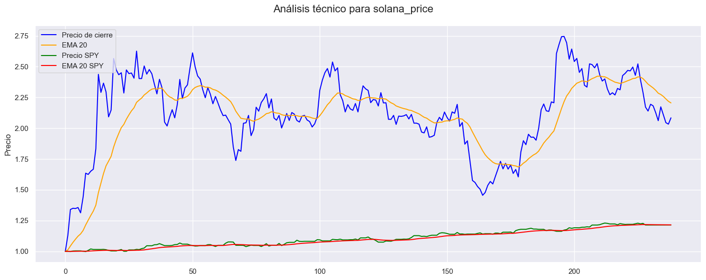

  <strong><h1>PI PT02 "Cryptocurrency Market Data Analytics"</h1></strong>

## **Objetivo**
El objetivo del proyecto es hacer un análisis del mercado de las criptomonedas, para determinar si conviene o no invertir en ellas, y en cuáles, en el año 2023, para obtener rendimientos mayores a inversiones más conservadoras, como pueden ser los bonos del Tesoro de Estados Unidos. La recomendación final está dirigia a un público que cuenta con una cartera de riesgo intermedia (ni muy conservadora, ni muy arriesgada), en donde deja un 25% de margen de su portafolio para invertir en alternativas de inversión consideradas de riesgo.

## **Resultados del análisis**
Adelantamos la recomendación del análsis que se expondrá debajo: elegimos a Solana como primer alternativa de inversión para cubrir el 18% de la cartera de criptomonedas, y le damos una chance a Bitcoin(7%), que s va en ascenso en las últimas semanas (es al segunda cripto de mejor desempeño del año) y tiene margen de suba. El resto, lo dejamos en inversiones seguras para ahorro de largo plazo, 75%, por ejemplo, en un 50% de ese 80% en SPY, y un 50% en bonos del Tesoro de Estados Unidos, considerados los más cosnervadores de todos los activos de inversión.

## **Desarrollo**

### Fuentes
A lo efectos del análisis, se tomaron como fuentes de datos primarias los datasets de CoinGecko, uno de los sitios más reconocidos que recaba las más amplia información sobre las criptomonedas, y que provee una api para que los desarrolladores puedan extraer dichos datos. CoinGecko provee información de mercado de más de 4000 criptomonedas. También se acudió a sitios especializados de inversión investing.com para poder tomar series de datos históricas de los bonos del Tesoro de Estados Unidos, y de la performance de las 500 empresas más importantes de Estados Unidos, medidas por un instrumento derivado que sigue al índice S&P 500, más conocido como el SPY.  Alternativamente, se buscaron los valores históricos del dólar blue en la Argentina, de sitios no oficiales pero que monitorean diaramiente las cotizaciones implícitas en el mercado para tomar el dólar, y para extraer dichos datos se utilizó la técnica de webscrapping.

## **EDA**
Como primer paso para comenzar con el análisis exploratorio de datos, se extrajo la serie de tiempo de las 10 monedas de mayor capitalización de mercado, debido a que son monedas que manejan volumen importante, y por lo tanto son relativamente líquidas, es decir, unn inversores puede ingressar y salir del mercado cuando lo considere, ya que seguramente podrá encontrar fácilmente un comprador u vendedor, depenndiendo de la operación que quiera realizar.

Es de destacar también que las 10 criptomonedas de mayor precio también coinciden con las de mayor volumen, aunque el orden en el ranking no sea el mismo, todas se mantienen entre las TOP TEN.
De esta forma, se determinó que Bitcoin, Ethereum, Cardamo, Ripple, Binancecoin, Solana, Polkadot, Dogecoin, Avalanche-2 y Shiba-inu integran el universo top 10 .
Nos planteamos como objetivo inicial analizar el desempeño de los precios de estas 10 monedas durante 2023, aunque más adelante, por los resultdos obtenidos durante el EDA, decidimos quedarnos sólo con 4 criptomonedas: Solama, Bitcoin, Ethereum y Ripple.

Procedimos a hacer un un dataframe con la serie de tiempo de las 10 monedas, en el que eliminamos algunas columnas del dataset original, para quedarnos sólo con capitalizacion de mercado, volumen, precio del día, entre las más signficativas (por ejemplo,se eliminaron los precios de apertura y cierre para simplificar el análisis). 
Hubo un procedimiento rápido de limpieza (nulos, faltantes, duplicados), debido que las bases de datos de CoinGecko estaban bastante limpias.
Extrajimos de la Api datos del mercado y e históricos de las criptomonedas mencionadas; para ello armamos una función que extrajera los datos históricos de las 10 monedas, y hubo que modificar la columna de fecha para poder trabajar con los datos. Luego, se fusionaron los dataframes de las 10 monedas en 1 dataframe, a través del campo fecham para comenzar con el análisis más en profundidad.

Al comparar la evolución de las monedas en un gráfico, observamos que había escalas muy diferentes entre las criptomonedas, sobre todo el Bitcoin se diferencia mucho del resto. En consecuencia, procedimos a normalizar variables pero antes calculamos los outliers y la distribucion de las frecuencias de cada uno, para saber por dónde se ubicó el precio con mayor frecuencia durante 2023.
Se observó que Ethereum, Solana, y Ripple tenían outliers, y se estudiaron los precios a partir de los umbrales. En el caso de Eheterum (umbral =1300 U$S) y Solana (umbral=15 U$D), se observó que los outliers tienen que ver con los mínimos del principios de 2023, cuando los precios de las criptomonedas estuvieron en lo más bajo, en lo que va de 2023. 
Encambio en Ripple (umbral 0.69 U$D), los outliers se encuentran al final de la serie, donde se observó que hubo una aceleración de precio desde fines de julio y quecontinuó en agosto. Dejamos en la serie los outliers en el primer caso (Ethereum y Solana) para conservar la integridad temporal, y en el segundo(Ripple), porque da cuenta de una aceleración de las últimas semanas y puede ser un determinante a la hora de decidir inveritr en dicha moneda. 
En cuanto a Ripple, las noticia públicas dieron cuenta de que tuvo una victoria parcial ante la comisión de regulación de EEUU (SEC) y animó a inversores a seguir invirtiendo. Los informes públicos disponibles señalan que:
    -Los inversores institucionales han invertido en Ripple (XRP) durante 16 semanas consecutivas según un informe de CoinShares.
    -Los activos bajo gestión de productos de inversión en XRP han aumentado un 127% desde principios de año.
    -Se han invertido mas de $11,25 millones en XRP desde comienzos de 2023.

Vale acotar que las criptomonedas tuvieron un pésimo año durante 2022, ya que venían de un período extraordinario pospandemia qu alcanzó el pico en 2021. El cambio de humor en 2022 se debió al cambio de política monetaria de la Reserva Federal de los Estados Unidos, que se endureció a través de la aplicación de sucesivas tasas de interés, para cumplir con el objetivo de bajar la inflación en los Estados Unidos. Luego, en 2023, la FED continuó con la suba de las políticas de tasas, pero de manera más moderada, y el mercado recomenzó la vuelta a la inversión en criptomonedas,  aunque de una menra mucho más débil, previendo que pronto la FED comenzará a estancar o flexibilizar su política de tasas de interés. Esta suposición permite prever que las FED inyectará de nuevo mayor liquiidez al mercado, y habrá en general más dinero disponible para inversiones y para arriesgar también en criptomonedas, considerados activos de mayor riesgo.

Asimismo, intentamos ver correlaciones entre monedas a través de distintas técnicas. Tanto en el scatterplot como en la matriz de correlación se observó que Bitcoin y Ethereum tienen una alta correlacón positiva. Cuando Bitcoin sube, también sube Ethereum, y lo mismo cuando el sentimiento es negativo hacia estas monedas: cuando baja una, también baja la otra. 
Por otro lado, se ubican Cardano, Binance, y Dogecoin, Avalanche-2 y Polkadot, todas  con una fuerte correlacion positiva. Esto es, cuando una de ellas se incrementa, también se incrementa la otra, aunque la correlación no implique que el ascenso de una moneda sea la causa de la otra. Solana, en tanto, sigue una dinámica independiente y no tiene tanta correlación con otras cripto ( por ejemplo con Ethereum no más de 50%).

## **KPI´s**

### **Variación en el precio del activo**

Luego procecidmos a analizar el desempeño de las monedas elegidas, según la variación en el precio. Esta un una métrica imprescindible, a la hora de determinar qué moneda elegir.
Entre las criptomonedas de mayor capitalización, durante el 2023 las monedas de mejor desempeño en el precio resultaron ser Solana(SOL) con un 108.35% de suba; el Bitcoin(BTC) trepó un 56,97%; Ripple(XRP)lo hizo en 54,41,%; y Ethereum(ETH) ascendió un 38%, entre las 4 primeras primeras del ranking de variación de precios (a la fecha del lunes 28 de agosto 2023). 

Con estos datos, decidimos quedarnos con estas cuatro primeras monedas para acotar el análisis y compararlas con el desempeño de las acciones de Estados Unidos. Para hacer dicho análisis, elegimos el SPY, que es el ticker y el nombre coloquial del derivado (ETF) que emula el comportamiento del S&P 500. El índice que mira el comportamiento de las 500 mayores empresas de la Economía de EEUU y es un buen indicador para medir la salud de las economía y las empresas en general de EEUU, que a su vez están muy afectadas por la inflación e inflación esperada, que se observa en las políticas que toma la Reserva Federal de los Estados Unidos, a través de la política monetaria y en particular de los movicmientos en las tasa de interés de referencia. 
Esto afecta particularmente el mercado de las criptomonedas, ya que si se espera que la economía de EEUU empeore, en el sentido de que suba la inflación y la FED se vea obligada a subir las tasas, habrá más retracción en la inversión y  fuga de capitales hacia activos considerados más seguros, que tendrán un rendimiento mayor, y son considerados y menos volátiles. Por el contrario, si hay mejora en la marcha de las empresas y de la salud de la economía en general, con una baja inflación, la FED hará la política contraria, expandirá más dinero en la economía para invertir, y las criptomonedas tendrán mayor margen de aceptación enre los inversores.    
En este sentido, procedimos a extraer los datos de precios de la base de datos de SPY y la incorporamos al dataframe de precios de las criptomonedas. Aquí si hubo que hacer algunas trasnformaciones para poder utilizar los datos. Por un lado, hubo que modificar la columna fecha, por otro lado, hubo que completar faltantes, porque SPY es un indicador que no tiene operaciones el fin de semana, y que opera en la Bolsa de EEUU. En cambio, las criptomonedas operan 24 horas, cualquier día del año, en OTC, over the counter, ya que no están reguladas oficialmente. Sólo existen algunos derivados que sí cotizan en la Bolsa de EEUU, y que emulan el comportamiento de las criptomonedas top.

Una vez realizadas las transformaciones pertinentes, se dividieron los precios por el primer valor para indexarlos a uno, y poder ver bien cual es la moneda que más varió y compararla con el comportamiento del SPY.
Corroboramos que Solana es la moneda que más creció en lo que va de 2023, y comprobamos que las tres criptomonedas retantes de las TOP4 repuntaron en linea con el SPY, que va anticipando que la inflación en EEUU se está pudiendo controlar y que en breve la FED virará el timón de su política. La suba del SPY es constante y menos pronunciada que las de las criptomonedas, que son más volátiles. Estos se debe a que el SPY es un índice que va marcando de una manera más conservadora las salud de las 500 empresas de la economía, si está subiendo, las compañias de EEUU en general están mejor. Aunque de manera más volátil, las criptomonedas TOP4 tuvieron una importante suba, mucho mayor al SPY, y eso tambbién tiene que ver con que son inversiones más, volatiles menos conservadoras y po sobre todo porque en 2022 hubo un desplome, y tienen aún mucho precio por recuperar de sus valores máximos históricos.

Pese a la expectacular suba de Solana de más de 108% durante lo que va de 2023 -al cierre de esta informe arañaba los 20 dólares, se encuentra lejos de su poco histórico de 2021 cuando alcanzó 258 dólares; en tanto Bitcion que escaló también más se 56%, cotiza a 26.000 dólares, esto es, menos de la mitad de su pico histórico de fines de 2021, cuando tocó los 68,992 dólares.

### **Indicador EMA20** 

Otro indicador clave que vamos a tomar en consideración para invertir o no en criptomonedas, y en cúal , es el EMA20, que calcula las medias móviles exponenciales, para determinar si una moneda está en su fase de suba (y puede resultar interesante para su compra) o eventual baja (y determinar si conviene vender dicho activo).
Para efectos de simplicidad y prácticos, quitamos los campos de precio de inicio y cierre de la base de datos, con lo cual no haremos gráficos de velas, sino de promedios exponenciales.
Hacemos promedios exponenciales (y no las medias simples) porque estos indicadores toman con mayor ponderación los ultimos valores de las serie, para tratar vaticinar una futura suba o baja en el precios

El EMA20 (Exponential Moving Average 20) calcula la media móvil exponencial de los últimos 20 días. Es decir, toma en cuenta los precios de los últimos 20 días, otorgando mayor peso a los datos más recientes y reduciendo gradualmente el peso de los datos más antiguos. Esto la hace más sensible a los cambios recientes en los precios y puede ayudar a capturar tendencias emergentes o cambios en la dirección del mercado más rápidamente que una media móvil simple (SMA).
Si el EMA20 está por encima del precio de cierre, puede indicar una tendencia alcista o positiva. Esto sugiere que la tendencia general de los precios es ascendente y el activo podría estar ganando fuerza. Puede interpretarse como una señal de compra.
Si el EMA20 está por Debajo del precio de Cierre, puede indicar una tendencia bajista o negativa. Esto sugiere que la tendencia general de los precios es descendente y el activo podría estar perdiendo fuerza. Puede interpretarse como una señal de venta.
Cuando existe un cruce entre el EMA y el precio de Cierre se dan dos situaciones:  un "cruce alcista", que ocurre cuando el EMA cruza por encima del precio de cierre, lo que puede indicar un cambio potencial hacia una tendencia alcista. Por el contrario, un "cruce bajista" ocurre cuando el EMA20 cruza por debajo del precio de cierre, lo que puede indicar uan potencial baja.

Por lo expuesto, tomamos el EM20 del pecio de Solana, y detectamos que al estar por arriba del margen de suba, y por lo tanto podría  haber margen de compra en futuro cercano, con una curva final que queda tirando a plana, distinto de Bitcoin y Ripple, que también  tienen margen de suba por el EMA20 pero ya la curva está claramente bajando, en comparación con el EMA20 de Solana. Ethereum sigue patrón muy similar a Bitcoin.

### **The Fear and Greed Index o Indicador del Miedo y Codicia**

Otro de los indicadores de desempeño que vamos a tomar en cuenta es el "The Fear and Greed Index in Investing", indicador popular de sentimiento en Bitcoin, pero es tomado en cuenta para otras criptomonedas también debido a que Bitcoin domina el espacio de las criptomonedas (tiene una dominancia de mercado de 47%) y de algua forma dictamina el comportamiento de otras criptomonedas. Hoy este indicador se encuentra en la etapa de "fear, con 39 puntos", esto es, viene de haber estado más bajo, con mayor miedo a invertir mayor a hoy, cuando ese miedo es menor, y por lo que se ve hay un magen para seguir invirtiendo cuando hay miedo, y esperar, hasta que se vaya el miedo del inversor y todo el mundo este comprando -mayor codicia-, y sea la hora de, precisamente, "salir de la corriente" en lo más alto.

Por otro lado, en nuestro análisis arriba observamos que Bitcoin Ethereum estaban altamente correlacionadas en los precios.
Solana en cambio, no tiene tanta relación con Bitcoin y y Ehereum, pero puede argumentarse que a medida que disminuye el miedo al Bitcoin, da lugar para invertir en criptomonedas alternativas y aquí Solana aparece como la favorita, por precio actual y proyecciones.
Otro dato a destacar de este indicador del es que sería más relevante para el corto plazo, y nosotros precisamente queremos armar una cartera de inversión en el corto plazo para decidir si destinar un 25% en criptomonedas y aprovechar la eventual suba de lo que queda del 2023, para un inversor de riesgo intermedio.

### Análisis técnico de Solana: más KPIS 
Dado el tiempo limitado para el trabajo, con estos indicios y nuestros kPIS, no valemos tambiénanálisis externos de otras fuentes para determinar la elección final de nuestra criptomoneda, que estimamos será Solana. Así,  tomamos el analisis técnico y fundamental de  para Solana, efectuado el 24 e agosto de 2023.
Asimismo, realizamos nuestros propios cálculos de MACD y RSI, para cobrroborar estas afirmaciones

**Análisis Técnico adicional de Solana** .En general, se prevé que SOL vuelva a subir, utilizando los indicadores MACD (Moving Average Convergence Divergence) y el RSI (Relative Strength Index), que son dos indicadores ampliamente utilizados en el análisis técnico del mercado financiero, incluidos los mercados de acciones, forex (de futuros) y criptomonedas. 
Ambos indicadores ayudan a los traders e inversores a evaluar la dirección y la fuerza de una tendencia, así como a identificar posibles puntos de reversión en el precio de un activo.
Explicamos un poco más de que se tratan estos indicadores clave:
- El MACD es un indicador de seguimiento de tendencia que se basa en la diferencia entre dos promedios móviles exponenciales (EMA) de diferentes períodos (corto y largo). Consiste en dos componentes principales:
  -  **Línea MACD**, es la diferencia entre el EMA de período corto y el EMA de período largo. Muestra la relación entre las medias móviles y ayuda a identificar cambios en la tendencia.
  - **Señal o Línea de Señal,** es en realdiad una especie de EMA de la línea MACD. Ayuda a suavizar las fluctuaciones y puede generar señales de compra o venta cuando cruza con la línea MACD.
El cruce de la línea MACD y la línea de señal, así como la relación entre la línea MACD y la línea cero, se utilizan para identificar tendencias alcistas y bajistas, así como posibles divergencias entre el indicador y el precio del activo.
- El RSI es un oscilador que mide la velocidad y el cambio de los movimientos de precio. Se calcula en función de la relación entre los incrementos de precio y las disminuciones de precio en un período de tiempo específico. El RSI oscila entre 0 y 100 y generalmente se muestra como una línea en un gráfico.
  - Un RSI por encima de 70 generalmente indica que el activo está sobrecomprado, lo que podría sugerir una posible reversión a la baja.
  - Un RSI por debajo de 30 generalmente indica que el activo está sobrevendido, lo que podría sugerir una posible reversión al alza.

En el caso puntual de Solana (SOL) se analizó con estos indicadores expuestos arriba:
Tendencia: todos los marcos de tiempo para la moneda continuaron con una tendencia a la baja (corto, mediano y largo plazo) durante más tiempo.
La línea MACD suele mantenerse por encima de la línea de señal MACD (alcista), aunque con altas y bajas, mientras que el RSI se encuentra or encima de 30 y por tanto el impulso de compra es fuerte.
Hacia el final de agosto se observa un cruce Bajista (Bearish Cross), que ocurre cuando el MACD cruza hacia abajo la línea de señal, si bien es una señal de que el impulso bajista está ganando fuerza, lo vemos como que puede ser una oportunidad para considerar posiciones cortas (venta).
Otro indicador esel volumen en los días al alza es más significativo que el volumen en los días a la baja, como lo muestra el indicador OBV (Volumen en balance) ascendente. Como resultado, la demanda (compradores) supera la oferta de los vendedores. (Esto no lo hicimos, debido a que no tomamos inicialmente datos de volumen, pero la fuente es Bitcoinwisdon.com).

Fuente: Bitcoinwisdom.com

### Análisis fundamental de Solana
Para este análisis se ha utilizado el documento técnico de solana y considerado su uso y potencial uso y las proyecciones de expertos, incluyendo Bitcoinwisdom.com
La moneda se describe en el documento técnico de Solana como “una arquitectura de cadena de bloques revolucionaria basada en Prueba de Historia (PoH), una prueba para confirmar la secuencia cronológica y la separación de eventos. Busca en sí ser superadora de las monedas más antiguas, como el Bitcoin, tiene bajas tarifas, alto rendimiento, es utilizada en un sinnumeros de aplicaciones. Se trata de una plataforma de blockchain que tiene la bondad de ser descentralizada. 

Entre los mayores usos, Solana es muy fuerte en DeFi (Finanzas Descentralizadas), ha atraído la atención de muchos proyectos de DeFi debido a su alta velocidad y baja latencia. Algunos protocolos DeFi que operan en la red Solana incluyen Serum (un exchange descentralizado), Raydium (AMM), Saber (establecoins) y Mango Markets (plataforma de trading).
También solana tiene presencica en juegos y NFT (Tokens No Fungibles): Solana ha sido adoptada por varios proyectos de juegos y NFT que se benefician de su rendimiento. Algunos ejemplos incluyen Star Atlas (un juego espacial en un metaverso, en donde se puede comprar y vender la moneda por ejemplo), Solible (plataforma NFT) y Degenerate Ape Academy (colección de NFT).
En mercados y e-Commerce, Solana también ha visto la adopción en aplicaciones relacionadas con el comercio electrónico y los mercados. Por ejemplo, Mercurial Finance es un protocolo que permite a los usuarios crear y gestionar mercados de futuros.
Asimismo, tiene aplicación en oráculos, que son esenciales para proporcionar datos externos a las dApps. Chainlink, uno de los principales proveedores de oráculos, tiene una integración con Solana para habilitar el acceso a datos en tiempo real
Por último, la tecnología de Solana también ha sido utilizada en proyectos más allá de las finanzas y el juego, como la exploración espacial y la investigación científica. Por ejemplo, Pyth Network, en colaboración con la Bolsa de Valores de Londres, utiliza la red Solana para proporcionar datos financieros en tiempo real, entre otros multiples usos.
Solana es un proyecto de código abierto que desarrolla una nueva cadena de bloques de alto rendimiento sin permiso, y que es administrado por la Fundación Solana, que se encuentra en Ginebra, Suiza.

## **Conclusión**
Por todas estas razones, por ser el activo de mayor capitalización, de mayor suba de precio en 2023, de que queda un potencial margen de suba, según se ve en el análisis conjunto de los indicadores el EMA20, en el Indice del Miedo y Codicia, en MACD, y RSI, elegimos a Solana como primer alternativa de inversión para cubrir el 18% de la cartera de criptomonedas, y le damos una porción a Bitcoin(7%), que es el resguardo de las cripto por excelencia, y que fue en ascenso en las últimas semanas y tiene margen de suba, en general con el mejor sentimiento cripto, y es la segunda de mejor desempeño.
Cabe destacar que no otorgamos más de 25% en total al mercado de criptomonedas, por considerarse aún mercados muy volátiles y no apto par cardícaos.
El resto, lo dejamos en inversiones más seguras para ahorro de largo plazo, 75%, por ejemplo, en un 50% den SPY, y un 50% en bonos del Tesoro de Estados Unidos, considerados los más conservadores de todos los activos de inversión, aunque  estos últimos rinden menos de 5% anual.

## Aclaración final
Por último una reflexión final en cuanto a las recomendaciones, es importante tener en cuenta que las interpretaciones aquí vertidas son indicativas, pero el inversor es quien tiene la última palabra.

